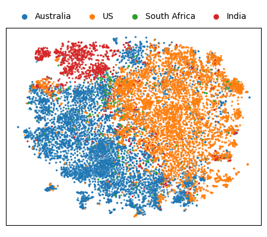

# Partial Answers as Artefacts

Work-in-Progress exploration of Fusion of Partial Answers as Artefacts for Multi-Task Classification.
Authors: Vilém Zouhar, Edu Vallejo Arguinzoniz.

## Running the code

### Preparation

- With Python `>=3.9`, install dependencies as `pip3 install -r requirements.txt`. The code is expected to be run in a Linux environment with the standard tools installed (bash, autotools).
- Run `make data_all` to load the data into `data/final/clean.json` and prepare all other crafted data (may require up to 20GB of disk space)
- Run the following command to create a new test data `clean_COP25.json` based on `~/Downloads/COP25.filt3.sub.json`. It is necessary to have access to all the data in order to provide consistent filtering.
`./src/data/prepare_clean.py --data-in data/final/all.json --data-out data/final/clean_COP25.json --extra ~/Downloads/COP25.filt3.sub.json `

The filtering is explained in the accompanying paper.
It boils down to consireding only non-sparse labels and samples with at least one label in the _subject_ and _geographic_ variables.

### Misc.

#### T-SNE

To visualize BERT embeddings, run `make tsne`.
If you get out of memory errors reduce the batch size in `Makefile` or run it on your CPU (via masking your CUDA device).
Note that this may take from a few minutes up to an hour, depending on your configuration, to complete.
The end result should be a graph similar to this one:



#### Variable Distribution

Run `make balance` to generate overview of class distributions (in LaTeX table formatting).

#### Feature Dependency

Run `make feature_dependency` to model the relationship between variables using logistic regression: $\hat{z} = p(-,\xi;\, \theta),\,\, \xi \in y$.
The final output should look like:


### Models

If the system has a compatible CUDA device visible to PyTorch, it will be used.
Otherwise the model will train on CPU/RAM.
You may enforce the script to use CPU/RAM (e.g. because of memory limitations) by prefixing the launching command with `CUDA_VISIBLE_DEVICES=;`.
This can also be used select which device you would like to utilize (if there are multiple), e.g. `CUDA_VISIBLE_DEVICES=2;` will use the thirds GPU device.

#### Main Model

To train the main model (Bert-based)
TODO

#### Baseline Models

TODO

#### Meta Model

The meta-model first needs generated data from the main model.
Currently the model can work only with the _month_ variable which is also explored in the paper.
In theory, there are no limitations to the variable selection and _month_ is chosen because of the highest improvement with artefact fusion.
Multi-output is not implemented.

The following code trains a model which takes artefact signature on input together with true posterior and hidden state.

```
# train primary model on 50% dropped out artefacts data
python3 ./src/model_main/train_lm_classifier.py -to month -ti craft -i data/final/Rv1_50_m.json
# get data from primary model
python3 ./src/model_main/eval_lm_classifier_artefacts.py -mp data/models/bert_cls_1_2_shallow_256_craft_month_Rv1_50_m.pt -to month -o data/misc/meta_{}.pkl
# train & evaluate meta-model
python3 ./src/model_meta/main.py -i data/misc/meta_month.pkl -cm indiv -pm true --model standard
```

The following model combinations are valid.
See the paper for explanation:

- `-cm {no,indiv,multi} -pm {true,frozen} --model standard`
- `-cm {no,indiv} -pm frozen --model joint`

## Repository structure

The source code is located in `src/`.
Scripts that produce figures are located in `src/figures/`.
All publicly exposed source files contain help messages which can be invoked with `-h` or `--help`.
Directory tree inside `data/` is automatically created when running `make data_all`.